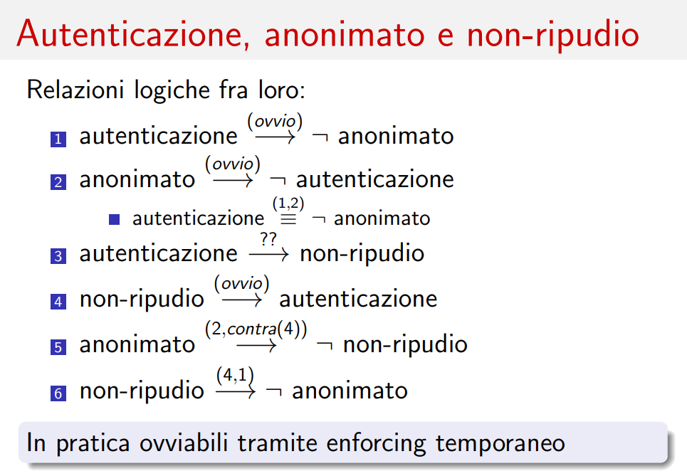

# Lezione di mercoledì 03 aprile 2024

<!--
[Foto](img/Esempio.jpg)
-->

## Autenticazione, anonimato e non-ripudio

- L'autenticazione esclude l'anonimato.
- L'anonimato esclude l'autenticazione.
- L'autenticazione garantisce il non ripudio?
  - Quando un utente si autentica su un servizio e le azioni vengono registrate in un log, questo non necessariamente garantisce il non ripudio. I log, simili a checksum, possono essere manipolati durante un attacco se non garantita l'integrità. Pertanto, l'autenticazione da sola non assicura la non ripudiabilità.
- Il non ripudio richiede l'autenticazione.
- L'anonimato implica mancanza di autenticazione, la mancanza di autenticazione implica mancanza di non ripudiabilità. Queste relazioni sono transitive.
- Il non ripudio richiede autenticazione; l'autenticazione, a sua volta, richiede anonimato per transitività.

## Cerimonia di Sicurezza

Protocollo di sicurezza che coinvolge attori umani (quando si effettua un esame universitario siamo parte di una cerimonia)

Anonimato miglior prerequisito per una valutazione equa ad un esame universitario. 
Come facciamo ad autenticare e rendere anonimo allo stesso tempo uno studente all'esame universitario?

## Separation Of Duty (Atto di fede)

Proprietà che richiede la suddivisione dei compiti o delle responsabilità tra più soggetti. Ad esempio, durante gli esami universitari, una persona potrebbe essere responsabile dell'autenticazione dei candidati, mentre un'altra persona si occupa della valutazione degli esami scritti.

## Public Auditability

L'auditabilità pubblica si riferisce all'autenticazione che avviene sotto gli occhi dell'individuo o di un pubblico. Ad esempio, durante un esame universitario, potrebbe essere utilizzato un talloncino contenente il nome dello studente, sigillato all'interno di una busta e poi chiuso con una firma a cavallo della busta per garantire l'integrità fisica e fornire evidenza di eventuali manomissioni (tamper evidence).

Successivamente, l'esame scritto e la busta contenente il talloncino vengono inseriti in un'altra busta che viene aperta solo durante la fase di correzione dell'esame. Tuttavia, non c'è garanzia che il nome contenuto nel talloncino non venga visualizzato prima della correzione del compito, sollevando dubbi sulla sicurezza del processo di auditabilità pubblica.

## Conciliare Autenticazione e Anonimato

Anche se si implementa una efficace separazione dei compiti, non risolviamo completamente il dilemma della conciliazione tra autenticazione ed anonimato. Anche un piccolo segno distintivo nell'esame scritto potrebbe compromettere il sistema, permettendo all'esaminatore di identificare il candidato.

L'autenticazione del candidato è un processo separato dall'anonimato richiesto durante l'esame. Tuttavia, l'anonimato può essere infranto quando viene associato il voto all'identità del candidato.

Pertanto, cercare di combinare autenticazione ed anonimato in un'unica soluzione risulta impossibile.

## Threat Model / Modello di Attaccante

Nel contesto della sicurezza, è essenziale definire il modello delle minacce o degli attaccanti.

## WATA (Written Authenticated Though Anonymous)

Il processo di WATA, acronimo di "Written Authenticated Though Anonymous", prevede due principali aspetti:

1) L'autenticazione dello studente, per la protezione dell'integrità dell'esame e per la validità dei risultati da parte del docente.
2) L'anonimato del compito, per garantire la privacy dello studente e ridurre il rischio di influenze esterne sulla valutazione.

Durante l'esame, uno studente riceve un talloncino che lo identifica (token), il quale viene successivamente portato a casa dall'utente al termine del compito. Tuttavia, c'è il rischio che lo studente possa manipolare il talloncino al fine di disassociare il codice a barre dalla propria identità.

Per mitigare questo rischio, il token necessita di una misura di integrità simile a quella presente sulle banconote. Nel caso di WATA, tale integrità è garantita da una firma a cavallo apposta dal docente, la quale non deve fuoriuscire dal token, che non può essere compromessa o rimossa dal talloncino. Questa firma non è immune agli attacchi, ma rende più complesso per lo studente alterare l'associazione tra il talloncino e la propria identità.

## Anonimato: Sinergia tra Misure di Sicurezza

Per garantire l'anonimato durante gli esami, è fondamentale adottare una combinazione di misure di sicurezza:

- Randomizzazione dei compiti: Assegnare i compiti in modo casuale ai candidati per evitare qualsiasi schema o prevedibilità.

- Copertura del barcode e altre informazioni scritte: Durante il processo di autenticazione, è importante coprire il barcode e qualsiasi altra informazione che possa rivelare l'identità dello studente.

## Domande di esame

- Nesso tra autenticazione ed anonimato (se si è autenticati certamente non si è anonimi) (esempio forum solo link)
- Differenza tra autenticazione e non ripudio
- Firma a cavallo
- Randomizzazione ed identificazione dei compiti scritti