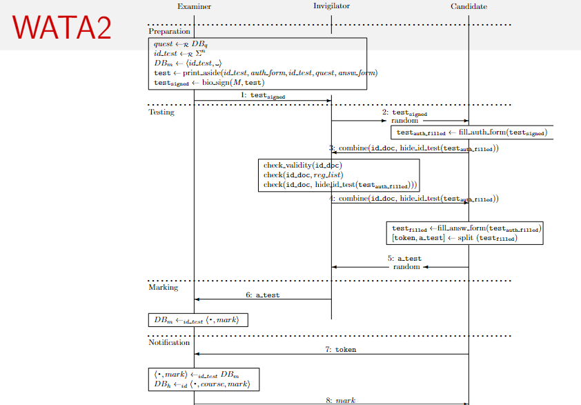
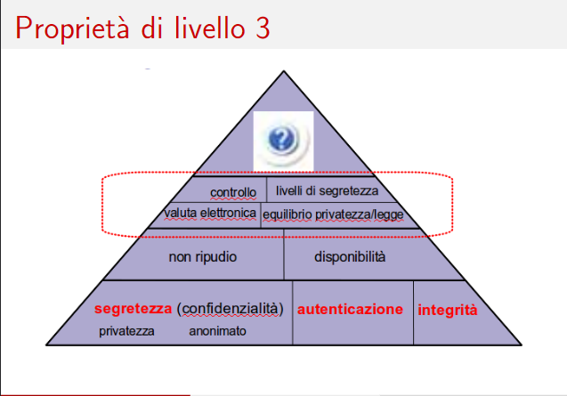

# Lezione di lunedì 08 aprile 2024

## WATA2 (Written Authenticated Though Anonymous)

Protocollo cyber-fisico garantisce una sicurezza integrata sia materiale (cartacea) che digitale, consentendo all'esaminato di rimanere anonimo durante la fase di valutazione da parte del docente.

Il protocollo prevede una suddivisione dell'esame in quattro fasi:

1. Preparazione
2. Test (effettuazione dell'esame)
3. Valutazione
4. Notifica del voto allo studente

La presenza dell'invigilator non risolve i problemi di sicurezza quando esaminatore e invigilator sono la stessa persona.

Il protocollo è caratterizzato da numerosi aspetti funzionali e si basa su un database contenente 1000 domande, le quali vengono randomizzate e assegnate casualmente a ciascun foglio di esame, con la possibilità di scegliere il numero di domande per compito.

### Fase 1: Preparazione dell'esame

1. Estrazione casuale delle domande dal database.
2. Generazione casuale di un ID alfanumerico di lunghezza n.
3. Creazione di una voce nel database contenente l'ID del test e inizializzazione della cella per il voto.
4. Emissione di:
   - Primo ID del test (token).
   - Form di autorizzazione (token).
   - ID del test (sul foglio di esame).
   - Domande d'esame.
   - Spazi vuoti per le risposte dello studente.
5. Apposizione della firma di integrità da parte del docente sopra il codice a barre e il nome e cognome (bio_sign).

### Fase 2: Effettuazione dell'esame

1. Consegna formale dei fogli da parte dell'esaminatore all'invigilator.
2. Assegnazione casuale dei compiti da parte dell'invigilator.
3. Compilazione da parte dello studente del modulo di autenticazione (token), firmando nella sezione apposita.
4. Fornisce le informazioni appena scritte all'invigilaitor per la fase di autenticazione un documento di riconoscimento, nascondendo gli elementi peculiari del compito come ad esempio la prima domanda.
5. Verifica da parte dell'invigilator della validità del documento, dell'iscrizione dello studente nella lista dei registrati all'esame e della coerenza tra i dati del documento di identità e quelli nel token di autenticazione.
6. Risposta dello studente alle domande del compito, completando il test.
7. Rimozione del token dal compito per mantenere l'anonimato, consegna dell'esame all'invigilator per la fase di valutazione.

### Fase 3: Valutazione dell'esame

1. Consegna formale dei test all'esaminatore da parte dell'invigilator.
2. Correzione da parte del docente degli esami scritti.
3. Registrazione del voto nel database.

### Fase 4: Notifica della valutazione

1. Lo studente o un suo delegato si presenta al dipartimento (irrilevante perchè il voto va comunque all'autore del compito) con il token tagliato durante la fase 2 per la notifica del voto.
2. Registrazione formale, in un ulteriore database (storico - h), delle informazioni del corso, dell'identità dello studente e del voto assegnato. Attualmente questo database è Smartedu.

Nella fase finale, c'è il rischio che solo il docente, attraverso il database, possa vedere il voto dell'esame e manipolarlo, ad esempio dicendo allo studente di essere stato bocciato o di aver ottenuto un voto basso, anche se il punteggio effettivo del compito de-anonimizzato è più alto. Inoltre, potrebbe omettere elementi dall'esame durante la valutazione e tenerli separatamente. Per prevenire questo, la comunicazione del voto dovrebbe essere pubblica, ad esempio tramite screen-sharing, per evitare discrepanze tra il voto comunicato e quello effettivamente assegnato.

Inoltre, c'è un problema di integrazione tra il protocollo WATA e il database finale di valutazione (GOMP) per renderlo pubblicamente verificabile.

## Disponibilità (non Denied of Service)

## Affidabilità (No Denial of Service)

L'affidabilità del servizio è una caratteristica di sicurezza fondamentale, ed è essenziale garantire che il sistema sia disponibile e funzionante in ogni momento.

Il rifiuto del servizio è considerato un attacco DoS (Denial of Service), come ad esempio una fork bomb che genera ripetutamente processi figlio, sovraccaricando il sistema e impedendone il corretto funzionamento.

Misure di mitigazione del problema:
- Autenticazione e restrizione dell'accesso agli utenti.
- Aumento della complessità dell'accesso al sistema, impegnando il chiamante computazionalmente e trasferendo il carico al chiamante per metterlo in attesa.

# Proprietà di Livello 3

## Controllo d'accesso

Ogni utente ha accesso solamente alle risorse e ai servizi per i quali è autorizzato.

Esempi:
- Autenticazione dell'utente.
- Definizione delle policy di sicurezza.
- Implementazione delle politiche (liste di controllo degli accessi (ACL), utenti limitati).

## Esempio di policy di sicurezza

Policy di sicurezza per l'accesso a dei file:

1. Un utente ha il permesso di leggere un qualunque file pubblico
2. Un utente ha il permesso di scrivere solo su file pubblici di sua proprietà
3. Un utente ha il divieto di fare il downgrade di un file, ovvero prendere una versione più vecchia di un file
4. L'utente ha l'obbligo di cambiare la propria password quando scade
5. Un utente segreto ha il permesso di leggere su un qualunque file non pubblico, come se fosse un utente root
6. Un utente segreto ha il permesso di scrivere su qualunque file non pubblico
7. Un amministratore ha il permesso di sosituire un quaunque file con una versione più obsoleta, il nome utente segreto è solo evocativo
8. Un utente che non cambia la sua password scaduta ha il divieto di compiere qualunque operazione
9. Un utente che non cambia la password non ha discrezione di cambiarla

## Elementi di una policy

- Ruoli
  - Utente, utente segreto, sistemista, utente negligente
- Utente
  - Qualunque entità che ricopra un certo ruolo
- Operazioni
  - Leggere, scrivere, downgrade, cambio password
- Modalità (Verbi servili(volere, dovere, potere), nessuna volontà ma obblighi)
  - Obbligo, permesso, divieto, discrezionalità

L'utenza prende il requisito autorizzativo di un ruolo

## Modalità e relazioni fra loro

x = operazione

- Modalità base
  - Obbligatorio(x)
- Modalità derivate
  - Vietato(x)
  - Permesso(x)
  - Discrezionale(x)
- Loro definizioni
  - Vietato = Obbligatorio(not x)
  - Permesso = Non obbligatorio(not x)
  - Discrezionale = Non obbligatorio(x)

Esempio x = fumare

Vietato fumare = Obbligatorio non fumare
Permesso di fumare = Non è obbligatorio non fumare
Discrezione nel fumare = Non è obbligatorio fumare 

## Inconsistenze di una politica

Le inconsistenze possono essere di due tipi:

- Contraddizione: Obbligatorio(x) <-> Non obbligatorio(x)
- Dilemma: Obbligatorio(x) <-> Obbligatorio(not x)

- Esempio di contraddizione: Obbligatorio fare l'esame <-> Non obbligatorio fare l'esame (a livello di modalità)
- Esempio di dilemma: Obbligatorio fare l'esame <-> Obbligatorio non fare l'esame (a livello di operazione)

## Domande di esame

- Per rispondere alle domande su WATA2 è necessario scrivere il codice presente nell'immagine
- Sul token quante firme ci sono? 2 una da parte dello studente e d una per convalidare l'integrità del compito da parte dello studente
- Perchè la firma del docente viene inserita nella fase di preparazione? Per evitare che il docente veda l'id del compito già assegnato ad un candidato specifico ed evitare di de-anonimizzarlo
- Quando finisce l'esame? Fino al momento in cui il voto non viene verbalizzato e registrato in un sistema affidabile e riconosicuto
- Perchè l'esame è pubblico? Misura di sicurezza a favore del candidato
- Come implementare l'autorizzazione: Autenticazione dell'utente, policy di sicurezza e tecniche che applicano una policy alle utenze
- Differenza tra contraddizione e dilemma

## Ricerche per casa

- Record dmark