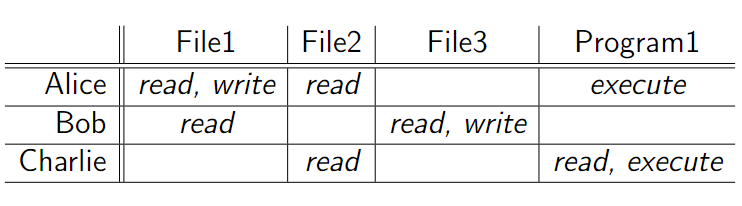

# Lezione di mercoledì 10 aprile 2024

## WATA: Ricezione del voto dello studente da remoto

Il protocollo viene modificato del tutto, come nel caso in cui l'esame venga svolto da remoto, chi svolge il ruolo di invigilator?

## Mandatory Access Control (MAC)

Rappresenta una policy sulla scrittura delle policy, sono basati sull'obbligo e di natura militare.

Esempio: Il sistema impone all'utente di modificare la password di sistema ogni 6 mesi, non esiste nei nostri sistemi Windows MAC o Linux

## Role-Based Access Control (RBAC)

Si basa su politiche non mandatorie, si presuppone uno schema del tipo utenti amministratori ed utenti base, il controllo di accesso in questo caso è basato sul ruolo.

Si basa sulle definizioni di Permesso e Divieto:
- Permesso <-> Non è vietato(x)
- Vietato <-> Non è permesso(x)

Politica molto utilizzata nei sistemi operativi attuali.

## Access Control Matrix (ACM)

Matrice dove le righe rappresentano i soggetti e le colonne gli oggetti, ogni intersezione tra riga e colonna (cella) indica il permesso del soggetto (s) sull' oggetto (o)

Esempio di tabella ACM:

L'ACM è la struttura più generale e completa, se la leggo in una sola dimensione (le righe) viene fuori una ACL, lista di tutti i permessi dell'utente, se leggo le colonne (CaL) si vedono i permessi su un file.

## Tassonomia di attaccanti

Si possono classificare per moventi: Ricchezza, Informazioni sensibili, Potere, Gloria, Divertimento 

## Modelli di attaccante

Un modello di attaccante specifica le capacità offensive di un preciso attaccante.
Il modello di attaccante sta alla cyber security come la complessità asintotica sta ad algoritmi e programmazione.

## Modello di attaccante Dolev-Yao (DY)

Dal nome dei suoi autori, modello massimamente offensivo per capire la robustezza dei nostri prodotti. Modello di attacco per la sicurezza di rete. Hanno preso come scenario, due servizi segreti 007 uno a Londra ed uno a New York, comunicando tra loro in maniera sicura (attenzione a dirlo in fase di esame, spiegare cosa significa sicura!). Volevano un modello molto robusto che rappresentasse i casi peggiori, supponendo che tutto il mondo colluda contro questa comunicazione tra i due agenti segreti 007. 

> Tutta la rete è ostile e massimamente offensiva, caso peggiore.

Massimanete offensiva: L'accante, che è la rete, controlla tutto.

Schema: Alice <-> Dolev-Yao <-> Bob

## Modello di attaccante General Attacker

Modem 56k: linea telefonica e di rete coesistevano, collegandosi ad internet la linea telefonica non funzionava più
ISDN: Linea telefonica e di rete separate

Lo schema individuato da Dolev-Yao non è più realistico, ogni attaccante ha i suoi interessi ed obiettivi.

Scenario: Trasferire un messaggio tra Alice e Bob in Dolev-Yao suppone che l'attaccante intermediario, la rete, riesca a recepire il messaggio. Nel modello General Attacker un attaccante potrebbe usufruire dell'attacco senza dirlo a nessuno.

# Autenticazione

## Ambientazioni di autenticazione

- Utente-computer: Accedere ad un sistema tramite password o biometria
- Computer-computer: un computer vuole accedere ad un altro indipendentemente dal suo utente (IP, MAC)
- Computer-utente: L'utente è convinto ed ha evidenza dell'identità del sito
- Utente-utente: meno nota

## Autenticazione utente-computer

- Basata su conoscenza: password, passphrase, PIN
- Basata su possesso: smart card, smart token
- Basata si biometria: impronta, iride, tono vocale

## Autenticazione basata su conoscenza

Si corrono i rischi di:
- Guessing: riuscire ad indovinare la password (brute force)
- Snooping: Sbirciare la password quando viene inserita
- Spoofing: Scoprire la password tramite fake login (trojan)
- Sniffing: Intercettare la password durante la fase di trasmissione (Wireshark)

## Guessing - Attacchi

1) Provo inizialmente con password brevi, tipiche e relative all'utente
2) Attacco dizionario: Vengono provate tutte le parole di un dizionario, arricchite con doppie parole, 0 al posto di o o 1 al posto di i
3) Attacco di forza bruta: Vengono provate tutte le parole costruibili in un dato vocabolario (alfanumerico, simbooli e caratteri speciali) di lunghezza via via crescente, tutte le combinazioni di lunghezza 1, poi lunghezza 2... complessità esponenziale

Controllo a soglia coerente con le linee guida NIST del 2016, tecnologia già implementata nei bancomat

## Guessing - Contromisure

1) Controllo sulla password: Lunghezza della password e presenza di lettere, simboli e caratteri speciali
2) Controllo sul numero di inserimenti: Controllo a soglia
3) Uso di CAPTCHA: Completely Automated Public Turing Test To Tell Computers and Human Apart

Turing test: Primo a congetturare l'intelligenza artificiale fu Alan Turing, il test di turing è stato battuto da una macchina solo pochi anni fa. Esempio: parola distorta

Le captcha vogliono portare il test di turing a livello grafico, un recente algoritmo di Google, che doveva riconoscere i numeri civici per poterli oscurare, riesce a violare il 99% delle captcha alfanumeriche.

Google ReCaptcha: Clicca qui per dimostrare che sei umano, tecnologia completamente rivoluzionaria, non è noto l'algoritmo dietro a questo sistema, si suppone che venga tracciato il movimento del mouse.

## Norme per una buona password

Bilanciare complessità e mnemocità, questo implica:
- Non usare una parola del dizionario
- Usare almeno 8 caratteri
- Non usare la stessa password per autenticazioni diverse

## Mantenere una password

- La password va mantenuta in qualche modo sul sistema al quale garantisce l'autenticazione utente
Soluzione: memorizzare in un database ciascuna password in qualche forma

## Compatible Time Sharing System

Password memorizzate in chiaro su un file di sistema protetto da politica di sicurezza. Si associano in una tabella username e password.

## Autenticazione basata su possesso

Identità dell'utente comprovata dal possesso di un oggetto magnetico o elettronico (smart card, token)

L'oggetto può memorizzare informazioni sensibili in modo interamente leggibile o leggibile coerentemente con un interfaccia funzionale

Limiti:

- Processo di autenticazione riconosce l'oggetto e non l'utente
- Smarrimento dell'oggetto più semplice rispetto a quello di dimenticare una password

Soluzioni:
- Autenticazione a 2 Fattori: Bancomat, bisogna avere la carta ed il PIN per usarlo

## Smart Token

Autenticazione basata sul PIN, genera un OTP accettato una sola volta dal server, autenticazione al sito web basato su conoscenza + password

Tipologie di token:
- A pulsante: Alla pressione di un pulsante viene generato un OTP (se lo perdo chiunque può leggere l'OTP)
- A PIN: Una volta fornito il PIN mi fornisce l'OTP (Passo di autenticazione allo smart token, più robusto)

1) Lunga password sul sito ed OTP con pulsante
2) Lunga password sul sito ed OTP con PIN

Nel caso 1 il sito potrebbe richiedere una password di lunghezza 12 e fornisce uno smart token a pulsante, il secondo caso richiede una password da 8 caratteri e richiede un PIN per l'accesso al token. Pressochè assimilabili le due tecnologie.

Alternativa moderna agli smart token: Mobile App con autenticazione biometrica

Differenza tra smart token ed app: Nel primo caso il software gira su un sistema isolato, nel secondo caso lo smartphone è interconnesso con il mondo e questo lo espone ad una grande quantità di vulnerabilità

## Funzionamento di uno smart token

- Chiave segreta (seme) memorizzata dalla fabbrica
- Tramite PRF si genera un numero pseudo-casuale tramite informazioni quali PIN ed ora generando una one-time password.
La OTP viene visualizzata sul display e rinnovata frequentemente ogni 30-90 secondi.

Smart token e server hanno un algoritmo in comune ed orologi sincronizzati

## Autenticazione basata su biometria

Possesso di caratteristiche biometriche, che sono univoche, comprova l'identità
- Fisica (impronta digitale, forma della mano, impronta della retina o del viso)
- Comportamentale(firma, timbro di voce, grafia, keystroke dynamics)

Tecnicamente meno accuerata dei primi due metodi ma comunque affidabile, non esistono due campioni biometrici uguali.

Si basa su una distanza minima della firma biometrica con quella registrata nel sistema, vedi slide 89

Le impronte digitali soniìo una misura di autenticazione storica, una volta si ottenevano tramite inchiostro e si suddividono in 3 grandi categorie (Loop, Arch, Whorl) vedi slide 92

## Domande di esame

- (Domanda preferita) Quali sono le inconsistenze di una politica, quali sono i problemi dietro le policy?
- ACM, ACL, CaL
- Come caratterizzare e classificare gli attaccanti
- Problemi delle password (Guessing, Snooping, Spoofing, Sniffing)
- Iter di attacco su una password
- Linee guida NIST del 2004 e del 2016
- Limiti delle captcha: per le captcha tradizionali alfanumeriche esiste un algoritmo di Google che riesce a violarlo
- Più sicuro un PIN di lunghezza 4 con controllo a soglia di numerosità 3, o password molto robusta con controllo a soglia di numerosità 3 (Risposta: è pressochè uguale probailità bassissima di 3/10000 per il PIN)
- PRF
## Ricerche per casa

