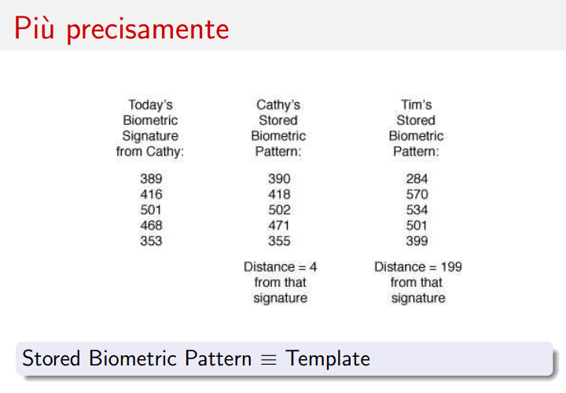
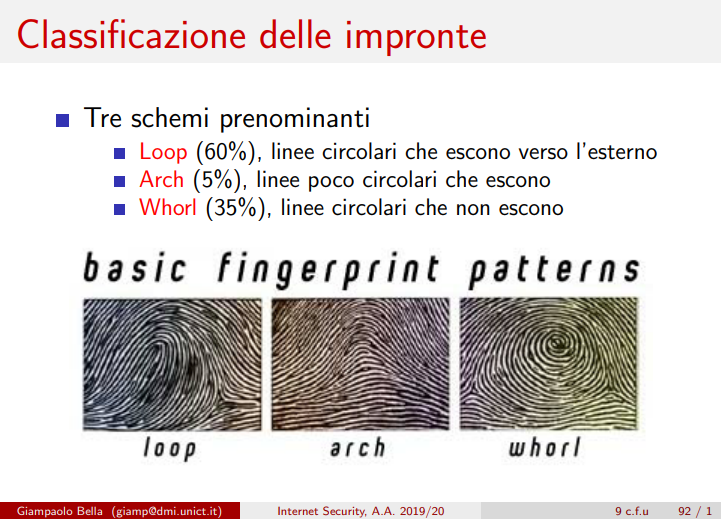

# Lezione di mercoledì 10 aprile 2024

## WATA: Ricezione del voto dello studente da remoto

Il protocollo viene modificato del tutto, come nel caso in cui l'esame venga svolto da remoto, chi svolge il ruolo di invigilator?

## Mandatory Access Control (MAC)

## Controllo d'Accesso Obbligatorio (MAC)

Il Controllo d'Accesso Obbligatorio (MAC) stabilisce una politica riguardante la scrittura delle policy ed è fondato sull'obbligo, con radici nell'ambito militare.

Esempio: Il sistema richiede all'utente di cambiare la password del sistema ogni sei mesi. È importante notare che i sistemi Windows e Linux che utilizziamo attualmente non implementano il Controllo d'Accesso Obbligatorio (MAC).

## Role-Based Access Control (RBAC)

## Controllo d'Accesso Basato sui Ruoli (RBAC)

Il Controllo d'Accesso Basato sui Ruoli (RBAC) si fonda su politiche non obbligatorie e si basa sulla definizione di ruoli utente, come amministratori e utenti base. In questo contesto, il controllo degli accessi è determinato dal ruolo dell'utente.

Il concetto chiave è rappresentato dalle definizioni di Permesso e Divieto:
- Permesso <-> Non è vietato (x)
- Vietato <-> Non è permesso (x)

Questa politica è ampiamente utilizzata nei sistemi operativi attuali.

## Access Control Matrix (ACM)

Questa matrice rappresenta lo stato dei permessi all’interno di un sistema. Le righe corrispondono ai soggetti (ad esempio, gli utenti) e le colonne corrispondono agli oggetti (ad esempio, i file). Una cella specifica nella matrice, indicata come ACM[s, o], mostra i permessi che il soggetto ‘s’ ha sull’oggetto ‘o’. La dimensione della matrice è proporzionale alla dimensione del sistema. In Linux, un soggetto ‘s’ può essere un gruppo di utenti.

Esempio di una tabella ACM:

- Lista di Controllo degli Accessi (ACL): Questa è essenzialmente ogni colonna dell’ACM, registrata con l’oggetto specifico. Mostra tutti i permessi che vari soggetti hanno su un particolare oggetto.
- Lista delle Capacità (Capability List): Questa è ogni riga dell’ACM, registrata con il soggetto specifico. Mostra tutti i permessi che un particolare soggetto ha su vari oggetti.

## Tassonomia di attaccanti

Si possono classificare per moventi: Ricchezza, Informazioni sensibili, Potere, Gloria, Divertimento 

## Modelli di attaccante

Un modello di attaccante specifica le capacità offensive di un preciso attaccante.
Il modello di attaccante sta alla cyber security come la complessità asintotica sta ad algoritmi e programmazione.

## Modello di attaccante Dolev-Yao (DY)

Modello di Attaccante Dolev-Yao (DY)

Il Modello Dolev-Yao, denominato dai suoi creatori, è un modello altamente aggressivo progettato per valutare la sicurezza dei nostri prodotti. È utilizzato per analizzare la sicurezza delle reti e rappresenta un tipo di attacco. Nella sua implementazione, viene considerato un scenario in cui due servizi segreti, identificati come 007, operano rispettivamente a Londra e a New York, comunicando tra loro in modo sicuro (è importante spiegare in che modo viene definita la sicurezza durante l'esame). L'obiettivo è creare un modello estremamente robusto che possa rappresentare le situazioni più critiche, ipotizzando che tutti gli attori nel mondo siano coinvolti nel tentativo di compromettere questa comunicazione tra gli agenti segreti 007.

> In questo contesto, l'intera rete è considerata ostile e aggressiva al massimo livello.

L'aggressività massima indica che l'attaccante, che è rappresentato dalla rete stessa, ha il controllo completo su tutte le operazioni.

La configurazione tipica è la seguente: Alice <-> Dolev-Yao <-> Bob

## Modello di attaccante General Attacker

Nel contesto dei modem 56k, la linea telefonica e quella di rete erano integrate, il che significava che una volta connessi a Internet, la linea telefonica diventava inutilizzabile. Con l'ISDN, invece, la linea telefonica e quella di rete erano separate.

Il modello proposto da Dolev-Yao non è più considerato realistico poiché ogni attaccante ha i propri interessi e obiettivi.

Nello specifico scenario di trasferimento di un messaggio tra Alice e Bob nel contesto del modello Dolev-Yao, si presume che l'attaccante intermedio, ovvero la rete stessa, possa intercettare il messaggio. Tuttavia, nel modello di Attaccante Generico, un attaccante potrebbe sfruttare un attacco senza informare nessuno.

# Autenticazione

## Ambientazioni di autenticazione

- Utente-computer: Accedere ad un sistema tramite password o biometria
- Computer-computer: un computer vuole accedere ad un altro indipendentemente dal suo utente (IP, MAC)
- Computer-utente: L'utente è convinto ed ha evidenza dell'identità del sito
- Utente-utente: meno nota

## Autenticazione utente-computer

- Basata su conoscenza: password, passphrase, PIN
- Basata su possesso: smart card, smart token
- Basata si biometria: impronta, iride, tono vocale

## Autenticazione basata su conoscenza

Si corrono i rischi di:
- Guessing: riuscire ad indovinare la password (brute force)
- Snooping: Sbirciare la password quando viene inserita
- Spoofing: Scoprire la password tramite fake login (trojan)
- Sniffing: Intercettare la password durante la fase di trasmissione (Wireshark)

## Guessing - Attacchi

1) Provo inizialmente con password brevi, tipiche e relative all'utente
2) Attacco dizionario: Vengono provate tutte le parole di un dizionario, arricchite con doppie parole, (0 al posto di o o 1 al posto di i)
3) Attacco di forza bruta: Vengono provate tutte le parole costruibili in un dato vocabolario (alfanumerico, simbooli e caratteri speciali) di lunghezza via via crescente, tutte le combinazioni di lunghezza 1, poi lunghezza 2... complessità esponenziale

Controllo a soglia coerente con le linee guida NIST del 2016, tecnologia già implementata nei bancomat

## Guessing - Contromisure

1) Controllo sulla password: Lunghezza della password e presenza di lettere, simboli e caratteri speciali
2) Controllo sul numero di inserimenti: Controllo a soglia
3) Uso di CAPTCHA: Completely Automated Public Turing Test To Tell Computers and Human Apart (Test di Turing Completamente Automatico e Pubblico per Distinguere Computer e Umani.)

Alan Turing fu il primo a teorizzare l'intelligenza artificiale e il test di Turing è stato superato da una macchina solo recentemente. Un esempio pratico è la visualizzazione di parole distorte che devono essere riconosciute.

Le CAPTCHA cercano di portare il test di Turing a un livello grafico. Un algoritmo recente di Google, che doveva riconoscere i numeri civici per oscurarli, è stato in grado di superare il 99% delle CAPTCHA alfanumeriche.

Google ReCaptcha è una tecnologia completamente rivoluzionaria che richiede all'utente di dimostrare di essere umano. L'algoritmo dietro a questo sistema non è noto pubblicamente, ma si suppone che tenga traccia dei movimenti del mouse.

## Norme per una buona password

Bilanciare complessità e mnemonicità, questo implica:
- Non usare una parola del dizionario
- Usare almeno 8 caratteri
- Non usare la stessa password per autenticazioni diverse

## Mantenere una password

- La password va mantenuta in qualche modo sul sistema al quale garantisce l'autenticazione utente
Soluzione: memorizzare in un database ciascuna password in qualche forma

## Compatible Time Sharing System

Password memorizzate in chiaro su un file di sistema protetto da politica di sicurezza. Si associano in una tabella username e password.

## Autenticazione basata sul possesso

Nell'autenticazione basata sul possesso, l'identità dell'utente è verificata tramite il possesso di un oggetto magnetico o elettronico, come una smart card o un token.

Questo oggetto può contenere informazioni sensibili memorizzate in modo completamente leggibile o tramite un'interfaccia funzionale coerente.

Tuttavia, ci sono dei limiti:

- Il processo di autenticazione riconosce l'oggetto, non direttamente l'utente.
- Il rischio di smarrimento dell'oggetto è più elevato rispetto alla dimenticanza di una password.

Per affrontare questi limiti, una soluzione comune è l'autenticazione a due fattori, come nel caso dei bancomat. È necessario possedere la carta (oggetto) e conoscere il PIN per utilizzarla, aumentando così il livello di sicurezza.

## Smart Token

Lo Smart Token è un dispositivo utilizzato per l'autenticazione che si basa su un PIN e genera un One-Time Password (OTP) accettato una sola volta dal server. È comunemente impiegato per l'autenticazione su siti web, richiedendo la conoscenza di una password oltre all'OTP generato dal dispositivo.

Esistono due tipologie principali di token:

- **A pulsante:** Genera un OTP premendo un pulsante. Tuttavia, se il token viene smarrito, chiunque lo trovi potrebbe leggere l'OTP.
- **A PIN:** Richiede l'inserimento di un PIN prima di generare l'OTP, rendendo il passaggio dell'autenticazione attraverso lo smart token più robusto.

Nel primo caso, un sito potrebbe richiedere una password di lunghezza 12 e fornire uno smart token a pulsante. Nel secondo caso, potrebbe richiedere una password di soli 8 caratteri e richiedere un PIN per l'accesso al token. Le due tecnologie sono praticamente equivalenti in termini di sicurezza.

Un'alternativa moderna agli smart token è rappresentata dalle app mobili che offrono autenticazione biometrica. Tuttavia, c'è una differenza significativa tra gli smart token e le app: nel primo caso, il software è eseguito su un sistema isolato nel dispositivo, mentre nel secondo caso lo smartphone è connesso al mondo esterno, aumentando potenzialmente le vulnerabilità.

## Funzionamento di uno smart token

Lo smart token funziona utilizzando una chiave segreta memorizzata dalla fabbrica. Prende informazioni esterne come il PIN e l'ora per generare tramite un algoritmo di funzione pseudo-casuale (PRF) una one-time password (OTP) tramite un algoritmo pseudo-casuale. La OTP viene visualizzata sul display e rinnovata ogni 30-90 secondi. Lo smart token e il server condividono un algoritmo comune e hanno orologi sincronizzati per garantire che la password generata sia accettata.

## Autenticazione basata su biometria

L'autenticazione basata su biometria si basa sul possesso di caratteristiche univoche del corpo per confermare l'identità dell'utente. Queste caratteristiche possono essere:

- **Fisiche:** Come impronte digitali, forma della mano, impronta della retina o del viso.
- **Comportamentali:** Come la firma, il timbro di voce, la grafia o la dinamica della digitazione.

Anche se tecnicamente meno precisa dei primi due metodi, l'autenticazione basata su biometria è comunque affidabile poiché non esistono due campioni biometrici uguali.

Questo metodo si basa sulla misurazione della distanza tra la firma biometrica dell'utente e quella registrata nel sistema, come illustrato nella slide 89.

Le impronte digitali sono un metodo di autenticazione storico, ottenute tradizionalmente con inchiostro, e si suddividono in tre categorie principali: Loop, Arch e Whorl, come mostrato nella slide 92.

## Domande di esame

- (Domanda preferita) Quali sono le inconsistenze di una politica, quali sono i problemi dietro le policy?
- ACM, ACL, CaL
- Come caratterizzare e classificare gli attaccanti
- Problemi delle password (Guessing, Snooping, Spoofing, Sniffing)
- Iter di attacco su una password
- Linee guida NIST del 2004 e del 2016
- Limiti delle captcha: per le captcha tradizionali alfanumeriche esiste un algoritmo di Google che riesce a violarlo
- Più sicuro un PIN di lunghezza 4 con controllo a soglia di numerosità 3, o password molto robusta con controllo a soglia di numerosità 3 (Risposta: è pressochè uguale probailità bassissima di 3/10000 per il PIN)
- PRF
## Ricerche per casa

