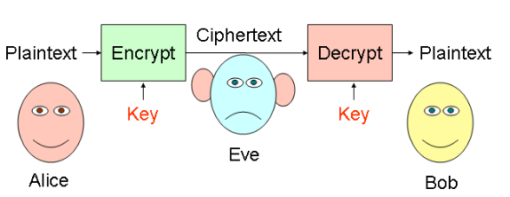

# Lezione di lunedì 15 aprile 2024

## Crittografia: Concetti di base

La crittografia è l'arte di trasformare le informazioni da una rappresentazione a un'altra, mantenendo la stessa semantica ma con una sintassi differente. Questa pratica ha radici antiche, risalenti all'antica Grecia, ma ha subito sviluppi cruciali negli anni '70. Prima di questo periodo, la cifratura era principalmente simmetrica, ovvero si utilizzava una sola chiave. Tuttavia, negli anni '70 ha preso forma la cifratura asimmetrica. Ad esempio, l'ENIGMA utilizzava un metodo di cifratura simmetrica con una chiave variabile. Questa tecnologia è ampiamente impiegata su Internet, come nell'utilizzo di HTTPS al posto di HTTP o di SSH invece di Telnet.

Cifrare è simile a tradurre in un'altra lingua: si modifica la sintassi (rappresentazione) ma non la semantica:

- Encrypt: Ciao -> Hello
- Decrypt: Hello -> Ciao

Le funzioni di crittografia sono pubbliche e accessibili a tutti.

La differenza tra cifratura e traduzione sta nella presenza di un parametro chiamato chiave crittografica. Normalmente, dalla stringa cifrata non è possibile estrarre l'informazione contenuta.

Un esempio di cifrario è il Cifrario di Cesare (spostamento alfabetico):

- Encrypt(m, k): CIAO -> DLBP (dove m = messaggio, k = chiave = 1)
- Decrypt(m, k): DLBP -> CIAO

Il compito della cifratura è nascondere la semantica di un messaggio, ma non la trasmissione del messaggio stesso, il che è significativo in termini di privacy.

Romperne la crittografia significa acquisire la semantica senza conoscere la chiave di cifratura (senza dover eseguire il processo di decifratura). Con un po' di fortuna, è anche possibile scoprire la chiave di cifratura, ma è un evento molto raro.

## Crittosistema

Un crittosistema è costituito da una coppia di algoritmi:

- Uno per crittografare e produrre un crittotesto (E).
- Uno per decriptare e produrre un testo in chiaro (D).

Ciascun algoritmo richiede due input: un testo e una chiave.

- Dato un testo m e una chiave k, il testo viene codificato come E(m, k), indicato come mk.
- Dato un crittotesto mk e una chiave k', il crittotesto viene decodificato come D(mk, k'), che produce m se specifiche condizioni legano k con k'.
- Non è necessario che k sia uguale a k'.

Quando si ha un crittotesto mk, non è essenziale che si possiedano le caratteristiche per decifrare il messaggio, ovvero applicare l'algoritmo di decrittazione. Decifrare con successo significa scoprire il testo in chiaro di un messaggio cifrato.

La chiave può essere la stessa usata per crittografare (in algoritmi simmetrici) oppure la sua inversa (in criptoalgoritmi moderni, ovvero asimmetrici).

L'associazione tra testo in chiaro e crittotesto dipende da un certo sistema.

## Crittografia in rete

Se Alice vuole inviare un messaggio cifrato a Bob e solo Alice e Bob conoscono la chiave o le chiavi crittografiche solo loro potranno comunicare, Eve non conoscendo la chiave crittografica può solo provare a decifrarlo, anche tramite brute force, ma non c'è la certezza di riuscire ad effettuare ciò con successo.

## Segretezza di una chiave

Se la lunghezza del segreto è k, ci sono 2^k possibili combinazioni per generare la chiave di cifratura, e la probabilità di indovinarla è 1/2^k. È quindi fondamentale avere un valore k elevato, spesso di 256 bit (come nell'AES 256).

La probabilità di rivelazione della chiave di un algoritmo crittografico non supera mai 1/2^k.

## Crittografia simmetrica

La crittografia simmetrica comporta la decifrazione del testo utilizzando la stessa chiave impiegata per cifrare il messaggio.

È possibile decifrare correttamente il messaggio solo quando k' = k.

**Equazione di correttezza:**
- D(E(m, k), k) = m: La decrittazione utilizzando k restituisce m.
- ∀k1. k1 != k −→ D(E(m, k), k1) != m: Se k' != k, non otteniamo il messaggio originale m.

Se un aggressore tenta di decifrare utilizzando chiavi casuali, non otterrà il messaggio corretto.

Esempi:
- Cifrario di Cesare, DES, 3DES
- Lunghezza tipica della chiave: 128/256 bit
- Velocità di esecuzione

## Crittografia simmetrica in rete

Una chiave a lungo termine, dal punto di vista della sua validità, non è un segreto che cambia frequentemente, come il numero della nostra carta di credito o la nostra password che viene cambiata ogni circa 6 mesi.

Un segreto che rimane valido per molto tempo è di grande importanza; più è lungo il periodo di validità, maggiore è l'importanza del segreto.

Immagina che Alice abbia una chiave a lungo termine e voglia inviare un messaggio in modo confidenziale, quindi lo cifra con questa chiave. Anche se Eve intercettasse il criptotesto, non riuscirebbe a decifrarlo con successo, garantendo così la confidenzialità. Quando Bob riceverà il criptotesto, proverà a decifrarlo ma dovrà conoscere la chiave.

Supponiamo che esista un modo sicuro per trasmettere la chiave in modo confidenziale. Tuttavia, non è necessario che Alice venga a conoscenza della chiave di Bob. Non c'è una connessione diretta tra la chiave cifrata e la password, e non è una buona pratica trasferire la chiave a lungo termine. La differenza principale sta nella lunghezza: le password sono generalmente corte (circa 8 caratteri, 64 bit), mentre le chiavi di cifratura sono molto più lunghe (256 bit).

Una chiave a breve termine è condivisa tra Alice e Bob solo per una sessione specifica. Il suo valore è contingente e contestualizzato, quindi è necessario un modo sicuro per trasmetterla. Non possiamo inviarla in chiaro, altrimenti sarebbe facilmente intercettabile, compromettendo così la sicurezza della chiave di cifratura.

## Limiti della crittofgrafia simmetrica

- Se Alice non vuole divulgare la sua chiave di cifratura a Bob:
    - Si può inviare una chiave a breve termine (kab) che può essere condivisa tra i due utenti.

- Scalabilità della soluzione: Se Alice desidera comunicare con Bob, necessita di una chiave di sessione specifica; se invece vuole comunicare con Charlie, avrà bisogno di un'altra chiave di sessione, diversa da quella precedente. Ogni coppia di utenti richiede una chiave di sessione unica.

- Come condividere la chiave di sessione in modo sicuro e confidenziale?

## Crittografia asimmetrica

- Ogni chiave k ha la sua chiave inversa k-1.
- Non è possibile ricavare k da k-1 e viceversa.

Per decifrare con successo un testo cifrato con la chiave k, è necessario utilizzare la sua chiave inversa k-1.

**Equazione di correttezza:**
- D(E(m, k), k−1) = m
- Per ogni k1, dove k1 != k−1, D(E(m, k), k1) != m.

Come si generano le chiavi di cifratura? Il generatore di chiavi produce simultaneamente la coppia di chiavi. Una metà è tenuta privatamente (chiave privata), mentre l'altra metà è resa pubblica (chiave pubblica).

**Esempi di crittosistemi asimmetrici**

- DSA, RSA con chiave di 1024 bit. La chiave è molto più lunga rispetto a quella simmetrica, rendendola più robusta ma anche richiedendo più risorse computazionali.

Le operazioni di encryption asimmetriche sono computazionalmente più costose rispetto a quelle simmetriche. Di conseguenza, è utile utilizzare sistemi ibridi che sfruttino entrambe le tecnologie, simmetrica ed asimmetrica.

Nella crittografia asimmetrica, si presuppone che ogni dispositivo disponga di una coppia di chiavi, una pubblica e una privata.

## Crittografia asimmetrica in rete

Se si utilizza la chiave privata per cifrare, è necessario utilizzare quella pubblica per decifrare.

Quando Alice decide di cifrare un messaggio, ha a disposizione tre chiavi:
- La sua chiave pubblica.
- La chiave pubblica di Bob.
- La sua chiave privata.

Alice rende nota a tutti la sua chiave pubblica e mantiene segreta la sua chiave privata per cifrare il messaggio. Bob riesce a decifrare il messaggio utilizzando la chiave pubblica di Alice.

Tuttavia, poiché la chiave è pubblica, può essere utilizzata anche da un attaccante senza problemi.

Se l'obiettivo della sicurezza è l'autenticazione e non la segretezza, Alice cifra con la sua chiave privata e tutti possono decifrare utilizzando la chiave pubblica di Alice. Poiché la confidenzialità del messaggio non è importante e si può dedurre che la chiave privata appartiene ad Alice, si riesce ad autenticarla con successo.

Se l'obiettivo della sicurezza è la segretezza, allora Alice sceglierà la chiave pubblica di Bob per cifrare. È necessario conoscere l'inversa della chiave pubblica per poterla decifrare correttamente.

## Limite della crittografia asimmetrica

Esistono anche problemi con la crittografia asimmetrica, come possiamo essere certi che la chiave pubblica di Alice appartenga effettivamente ad Alice?

Se Alice cifra con la sua chiave privata e Bob decifra il messaggio con una chiave pubblica di un soggetto diverso da Alice, otterrà un messaggio leggibile e comprensibile. Questo significa che Bob autenticherà X invece di Alice, quindi è necessaria una **certificazione**.

Un altro esempio è quando Alice intende inviare un messaggio confidenziale a Bob utilizzando la chiave pubblica di cifratura di Bob. Tuttavia, Alice potrebbe erroneamente utilizzare la chiave pubblica di un soggetto diverso da Bob e consegnare il messaggio a un altro utente.

## Riepilogo crittografia simmetrica ed asimmetrica

- Crittografia simmetrica: Per condividere un messaggio in modo sicuro, si utilizza un sistema di scambio di chiavi protetto o si trasmette la chiave simmetrica in modo sicuro prima di inviare il messaggio. Questo assicura la segretezza del messaggio.

- Crittografia asimmetrica: Per verificare il proprietario di una chiave pubblica, è necessaria una certificazione, che può essere ottenuta da un'autorità di certificazione affidabile. Questo processo conferisce autenticità alla chiave pubblica del destinatario.

Utilizzando queste tecniche, è possibile ottenere le proprietà di sicurezza di livello 1 (Segretezza, Autenticazione ed Integrità)

## Crittosistema sicuro

- Sia calcolato E(m,k) per ogni testo m e chiave k ;
- Sia calcolato D(E(m,k),k-1) = n per ogni chiave k1
tale che k1 != k se il crittosistema  e simmetrico, o
k1 != k−1 se il crittosistema  ́e asimmetrico;
- Allora l’accesso a n non aumenti significativamente
la probabilità di un attaccante di indovinare m o sue
porzioni

Crittosistema sicuro se la probabilità di scoprire la chiave crittografica non miglori nonostante la pubblicità dell'algoritmo.

## Hash Crittografico

Una funzione crittografica di hash è un algoritmo matematico che converte dati di lunghezza arbitraria in una stringa binaria di dimensione fissa, chiamata valore di hash o message digest. 

È progettata per essere unidirezionale, rendendo difficile invertirla. 
Deve essere unica per ogni messaggio, deterministica (lo stesso input produce sempre lo stesso output), e veloce da calcolare. 

Le sue proprietà la rendono adatta per firme digitali, codici di autenticazione dei messaggi e altre forme di autenticazione, oltre che per la rilevazione di impronte digitali, dati duplicati e checksum per la corruzione dati.

Caratteristiche delle funzioni di hash:
- Il calcolo dell'hash è molto semplice.
- È impossibile generare il messaggio originale partendo dall'hash.
- Anche cambiando un solo bit nel messaggio, l'hash cambierà completamente, generando codici totalmente diversi.

Le funzioni di hashing e di cifratura sono diverse perché tramite l'hashing non è possibile rigenerare il messaggio originale dall'hash, mentre con la cifratura si possono utilizzare due parametri di input per l'operazione.

## CTSS + Hashing

Negli anni '60, al MIT, il Compatible Time Sharing System (CTSS) è stato introdotto. Le password erano memorizzate in chiaro su file di sistema, ma erano protette da politiche di sicurezza. Si trattava di un'idea circolare: il controllo dell'accesso era basato sull'autenticazione, e viceversa. Tuttavia, si registrarono numerosi attacchi.

Per affrontare questa vulnerabilità, venne proposto di potenziare CTSS con una funzione di hash, come sviluppato presso l'Università di Cambridge nel 1967. In questo sistema, il file delle password memorizzava l'hash di ciascuna password, migliorando così la sicurezza complessiva del sistema.

**Salting**

Il **salt** è un messaggio casuale, inizialmente di 12 bit ma oggi considerato insufficiente, che viene aggiunto a una password per proteggerla dagli attacchi dizionario prima di applicare l'hash.

Unix salvava le password in memoria generando un salt per ciascuna password da memorizzare. Utilizzava la password per codificare una stringa di zeri insieme al salt tramite la funzione di encryption crypt(3) basata su DES.

L'uso di una funzione di encryption per generare una funzione hash, come crypt(3), è un esempio storico. Criptava una stringa di zeri estesa con 12 bit di salt randomico, funzionando come una discreta funzione hash per il suo tempo.

Questo approccio sfrutta in modo astuto un algoritmo di encryption che soddisfa le caratteristiche di una funzione hash.

Il salt complica gli attacchi, mentre il pepper, sebbene fisso, allunga l'input e aumenta la complessità dell'hash, rendendo più difficile la pre-elaborazione degli input possibili.

## Unix: Aggiunta di una nuova password

## Aggiunta di una nuova password in Unix

1) Si ottengono 56 bit utilizzando i 7 bit meno significativi dei primi 8 caratteri della password.
2) Questi 56 bit vengono utilizzati come chiave per criptare il salt e una stringa di zeri.
3) La password non è più memorizzata come testo in chiaro, ma viene utilizzato il segreto da proteggere come chiave anziché come testo in chiaro. 

**Non viene utilizzato l'hashing**

## Tabella Rainbow

Le tabelle rainbow sono un metodo di ottimizzazione per gli attacchi di forza bruta contro le funzioni di hash, mentre l'attacco per invertire l'hash sfrutta queste tabelle precalcolate per trovare corrispondenze tra hash target e valori originali.

## Domande di esame

- Limiti della cifratura: Un messaggio cifrato non è nascosto, si vede ed è un problema significativo in termini di privacy (informazione utile in termini di analisi forense e spionaggio)
- Cos'è un crittosistema?
- Come scambiare in modo sicuro le chiavi crittografiche
- Definizione formale di crittografia simmetrica (usare le formule matematiche di pagina 99)
- Password e chiave a lungo termine requisiti di segretezza e confidenzialità
- Generazione delle chiavi di cifratura
- Come ottenere segretezza con crittografia asimmetrica?
- Come ottenere autenticazione con crittografia asimmetrica?
- Weakness della cifratura asimmetrica (certificazione)
- Proprietario di una chiave pubblica: Chi ha l'altra metà privata della chiave
- Definizione di Crittosistema sicuro
- Differenza tra hashing ed encryption
- Brute forcing sull'hash per invertire l'hash
- Utilizzo di salt e pepper nella memorizzazione delle password

## Ricerche per casa

- Diffie Hellman key exchange
- Standard cifratura simmetrica AES 256