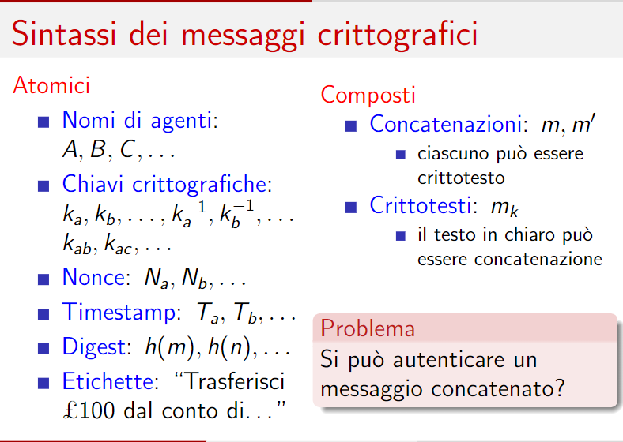

# Lezione di mercoledì 17 aprile 2024

## Appunti aggiuntivi sulle policy: Problemi sulle inconsistenze

Se la policy dovesse un giorno rispettare nuovi requisiti, un'idea banale è quella di aggiungere una nuova regola che la soddisfi, tuttavia questo porterebbe alla nascita di n nuove inconsistenze.

**Come risolvere le inconsistenze?**

Si imposta un ordine di priorità sulle regole, ad esempio ha priorità maggiore l'ultima regola inserita rispetto a quelle meno recenti.

Es:
1. Nessuno studente può accedere in aula
2. Gli studenti dottorandi possono accedere in aula

Questo porterebbe una inconsistenza, ma essendo stata inserita la seconda regola più recentemente avrà priorità maggiore rispetto alla prima

Ordine di priorità dei firewall: default rule ha sempre la priorità più bassa rispetto alle altre regole

## Unix: verifica di una password

Misura che mi permette di ottenere segretezza ed autenticazione, ma non abbiamo detto ancora nulla sull'integrità

Hash crittografico, crypt3 (guarda solo i primi 8 caratteri, meglio scegliere una password più grande)definita per mezzo di una primitiva crittografica

Le tabelle rainbow, sono una pretabulazione degli hash al fine di invertirli, ottimizzate anche in termini di spazio

In fase di verifica di una password, il programma di verifica di autenticazione cerca John nella tabella trova il sale, insiemee alla password viene calcolato crypt3 e si ottiene ciò che è registrato nella tabella se sono uguali allora John viene autenticato

## Freshness (Essere recente)

Attributo, caratterizzazione, di almeno due proprietà fondamentali della sicurezza: confidenzialità ed autenticazione.

Più è recente un segreto maggiore sarà l'affidabilità, importante quindi cambiare spesso la password

La freshness dell'autenticazione è fondamentale.

Autenticazione bancaria:
1) John si autentica all'accesso
2) John effettua una operazione finanziariamente sensibile (operazione dispositiva) tramite 2FA (Normativa PSD2) ulteriore misura di sicurezza
3) La banca onora la richiesta 2

Esempio:
1) John si autentica alle 10:00
2) John effettua uan richiesta di bonifico alle 10:15, la banca dovrebbe concedere questa operazione?

Come facciampo a capire che la richiesta di bonifico provenga dallo stesso client che si è autenticato alle 10:00?

**Cosa fa la banca alla richiesta di autenticazione dell'utente?**

1a) Controllo dell'identità di John
1b) Se il controllo va a buon fine si crea un nuovo ID di sessione
1c) Inserimento dell'ID di sessione all'interno dei cookie di sessione
1d) Invio del cookie al client
1e) Memorizzazione del cookie di sessione

Ogni qualvolta si voglia effettuare un'operazione dispositiva si invia il session cookie, viene verificato ed autorizzato il movimento.

Session cookie fondamentale dal punto di vista della segretezza, esiste un protocollo (TLS) che gestisce l'autenticazione ed i cookie di sessione. Chiunque sia in possesso del session ID può operare a nome di chi si è autenticato

Perchè il session ID? Perchè altrimenti l'utente dovrebbe autenticarsi ad ogni operazione effettuata

Nonce: Number Only Once, numero random utilizzato a livello HTTP che viene generato solo una volta, il session ID è un nonce

Che caratteristiche deve avere il Session ID?
- Deve essere univoco nel tempo (evitando così l'attacco che esploiterebbe il riutilizzo del session ID)
- Per evitare brute force attack deve essere un numero molto grande per garantirne la segretezza

Attacco che sfrutta la mancanza di freshensss: Replay attack

## Protocolli basilari per la freshness

Il timestamp lo inserisce chi *deve* dare garanzia di freshness
La nonce lo inserisce chi *vuole* ricevere garanzia

## Dalla crittografia alla sicurezza

Come ottenere le 3 proprietà fondamentali: Segretezza, autenticazione ed Integrità
I protoclli di sicurezza utilizzano modelli crittografici analizzando i casi peggiori di attacco assumendo che la crittografia funzioni, modello Dolev Yao

**Timestamp**

Marcatore temporale, si presta bene alla verifica della freshness (current time - generation time of timestamp)
diventa critico e sensibile se alterato nel traffico o falsificato dal mittente, richiede una dose di fiducia sull'onesta di chi lo affigge, necessario l'orologio sincronizzato (NTP Network Timing Protocol garantisce la sincronizzazione).

## Sintassi dei messaggi crittografici

Come autenticare un messaggio concatenato?
Posso io ricevente avere una garanzia di autenticazione sul messaggio, posso derivare la proprietà che il messaggio sia autentico? **NO**

Esempio di messaggio concatenato:

Alice riceve un messaggio concatenato (m,n) che non è possibile autenticare, perchè nell'invio del messaggio tra Alice e Bob l'attaccante Charlie potrebbe modificare n con n'.

Alice --- (m,n) ---> Bob

Attacco: Alice --- (m,n) --- Charlie --- (m,n') ---> Bob

## Sintassi di un protocollo di sicurezza

L'etichetta del mittente diventa irrilevante, es: IP mittente nel pacchetto può essere modificato per effettuare un attacco, non è affidabile e non garantisce una misura di autenticazione

A garantire l'autenticazione è il traffico stesso tramite crittografia, sappiamo che la crittografia garantisce autenticazione

## Protocolli basilari per la segretezza

- Crittografia simmetrica

Supponiamo che esista una chiave di sessione condivisa tra A e B e solo da loro. Il messaggio è confidenziale solo in virtù di questa condizione

A invierà a B un messaggio cifrato con la chiave Kab a B

- Crittografia asimmetrica

Assunzioni iniziali: 
- B deve avere una coppia di chiave valida e certificata, la chiave privata deve essere sicura e non scaduta
- A deve verificare le chiave pubblica sia di B

A prende la chiave pubblica del destinatario B per decifrarlo serve la chiave privata di B

## Protocolli basilari per l'autenticazione

- Crittografia simmetrica
    - Assunzione 1: Chiave condivisa solo tra A e B
    - Assunzione 2: B deve verificare l'assunzione 1

La differenza tra l'Assunzione 1 e l'Assunzione 2, nell'assunzione 1 non è specificato chi deve sapere il contenuto, nell'assunzione 2 si specifica che deve essere solo B a sapere il contenuto, l'assunzione 2 permette a B di rilevare il mittente del messaggio e quindi di autenticarlo

- Crittografia asimmetrica:
    - Assunzione 1: A deve avere una chiave privata valida
    - Assunzione 2: B deve poter verificare la chiave di A

Serve anche questa volta certificazione, chi decifra decide che il mittente è il proprietario della chiave pubblica

Obiettivo è l'autenticazione, non mi interessa il contenuto del messaggio, posso scrivere ciò che voglio.

## Combinare segretezza ed autenticazione

- Crittografia simmetrica
    - Assunzione 1: Chiave condivisa solo tra A e B
    - Assunzione 2: B deve poter verificare l' Assunzione 1

    Condizioni dell'autenticazione che aumentano quelle della segretezza
- Crittografia asimmetrica
    - Assunzione 1: B deve avere una chiave privata valida
    - Assunzione 2: A deve verificare la chiave di B
    - Assunzione 3: A deve avere una chiave privata di valida
    - Assunzione 4: B deve verificare la chiave di A

    Certificazione universale, public key infrastructure

## Come ottenere l'integrità

L'integrità è sempre a rischio, utilizziamo le funzioni hash con la caratteristica che l'entropia dell'input sia magnificata nell'entropia dell'output.

Utilizzo del checksum sui download, quando scarichiamo un file e ci viene fornito l'hash bisogna verificarlo per ottenere la proprietà di integrità.

Questo protocollo ha delle vulnerabilità l'attaccante potrebbe cambiare m in m', ricalcolare l'hash di m' ed inviare il tutto al destinatario

Quando scarichiamo un file (m, h(m)) Alice invia a Bob solamente m, h(m) è un semplice testo visualizzato a video, se l'attaccante cambia m in m' deve anche violare il sito modificando h(m) in h(m') per far credere a Bob di aver scaricato il file corretto.

Come impedire che l'attaccante riesca a cambiare h(m) in h(m')? Possiamo cifrare l'hash con la chiave privata del mittente. Questo protocollo prende il nome di firma digitale.

Come è possibile ottenere certificazione con la cifratura simmetrica?

A -> B: m, h(m, Kab) protollo MAC Message Authentication Code, si aggiunge autenticazione all'hash. Inserire dentro l'hash funziona come cifrare l'hash con la chiave

## Domande di esame

- Funzioni hash proteggono la rappresentazione in memoria di massa delle password, come funziona il controllo della password al login?
- Perchè la freshness è importante e come si fa (usand
o le nonce)
- Come usare il timestamp per ottenere garanzia della freshness
- Perchè Dolev Yao non rompe la crittografia
- Differenza tra assunzione1 ed assunzione2 slide 121 crittografia simmetrica
- Perchè 4 assunzioni nel combinare sicurezza ed autenticazione? Sono l'unione dei 2 protocolli visti
- Scrivere un protocollo elementare basato su cifratura asimmetrica che garantisca segretezza ed autenticazione

## Ricerche per casa

- Session Hijacking