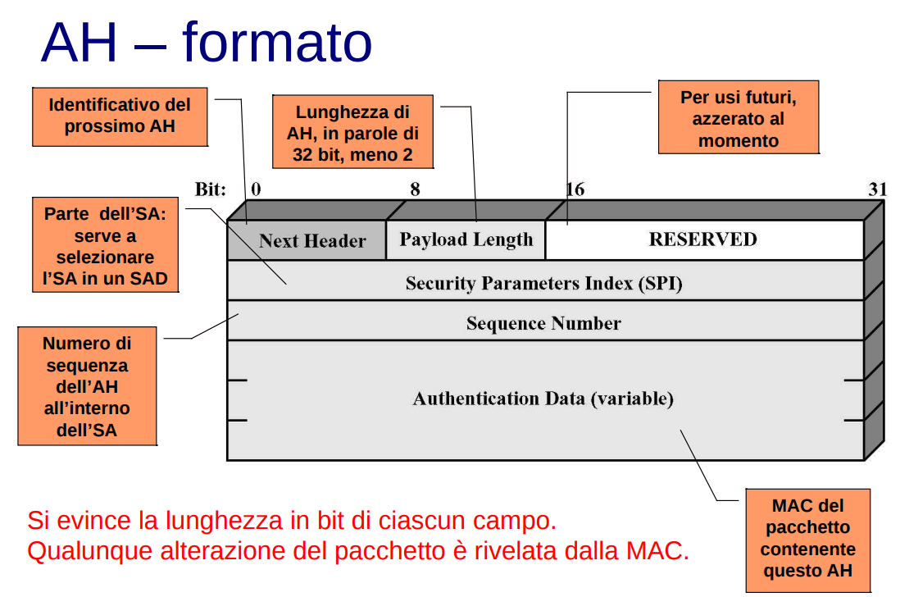
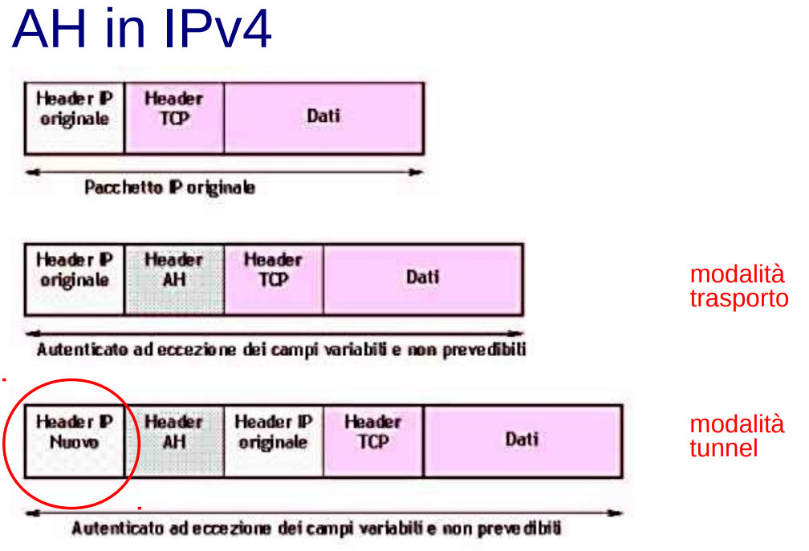
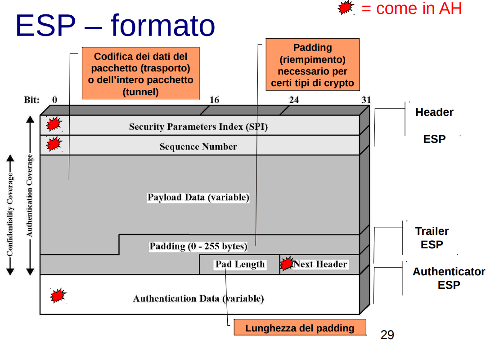
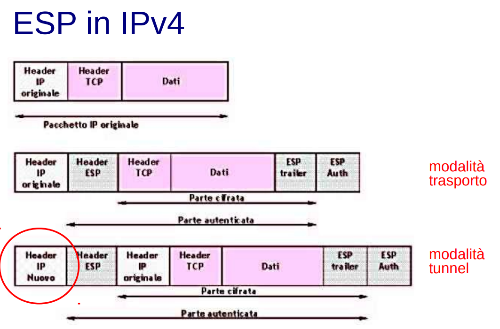

# Lezione di lunedì 13 maggio 2024

## IPSEC: Sommario

Una tecnologia universale per garantire la sicurezza dei protocolli di rete.
Integra le tecnologie e i protocolli di rete con i metodi precedentemente discussi.

È essenziale proteggere i pacchetti attraverso la crittografia per garantire la confidenzialità; otterremo l'autenticazione e l'integrità attraverso la costruzione del Message Authentication Code (Cifratura simmetrica).

Prerequisito essenziale: Condivisione della chiave.

## Sicurezza a quale livello

La sicurezza può essere integrata a vari livelli nello stack TCP/IP. Al livello inferiore, diventa più trasparente e rigida, mentre al livello superiore richiede una gestione dedicata, offrendo così maggiore flessibilità.

## Sicurezza a livello di rete

La sicurezza a livello di rete presenta vantaggi e svantaggi distinti:

Pro:
- Le applicazioni e gli utenti possono rimanere all'oscuro delle procedure di sicurezza.
  
Contro:
- Tuttavia, può appesantire significativamente le comunicazioni, favorendo attacchi di tipo DoS.
- Potrebbe richiedere modifiche al sistema operativo.

## Sicurezza a livello di trasporto 

Sicurezza a livello di trasporto offre vantaggi e svantaggi distinti:

Pro:
- Essenzialmente, può essere implementata o a livello di trasporto o direttamente nelle applicazioni.
- I principali browser sono dotati di client TLS integrato.

Contro:
- Naturalmente, richiede modifiche (anche minime) al livello che la riceve.

## Sicurezza a livello applicazione

Sicurezza a livello di applicazione presenta vantaggi e svantaggi distinti:

Pro:
- Consente una sicurezza personalizzabile, gestita direttamente dalle singole applicazioni.

Contro:
- Tuttavia, progettare la sicurezza a questo livello può essere ingannevole e comportare rischi imprevisti.

## IPSEC

IPsec è una suite di tre protocolli fondamentali:

- **IKE (Internet Key Exchange):** Implementa il protocollo Diffie-Hellman per avviare la sicurezza delle comunicazioni.
- **AH (Authentication Header):** Fornisce autenticazione e integrità dei dati.
- **ESP (Encapsulated Security Payload):** Garantisce la confidenzialità dei dati.

Mentre è obbligatorio per IPv6, per IPv4 è facoltativo.

Non è necessario che tutti i nodi di una rete siano compatibili con IPsec; è sufficiente che siano compatibili con IP, a differenza di IPv4 dove ogni nodo deve essere conforme a IP. In IPsec, è sufficiente che i nodi mittente e destinatario siano conformi a IPsec.

## Security Association (SA)

## Security Association (SA)

La Security Association (SA) rappresenta una regola fondamentale o policy di IPsec.

Si tratta di una relazione unidirezionale tra mittente e destinatario; sono necessarie due SA per una comunicazione bidirezionale.

L'identificatore della policy è chiamato SPI (Security Parameter Index).

Una SA specifica il tipo di sicurezza utilizzato (AH o ESP) e comprende tre campi principali:

- SPI: Security Parameter Index, che identifica la policy.
- Indirizzo IP di destinazione.
- Identificatore del protocollo (AH e/o ESP).

## Security Association Database (SAD)

Ogni nodo della rete deve gestire un Database delle Security Association (SAD) con tutte le SA attive su quel nodo.

Ogni voce nel database contiene tutti gli elementi della SA e include ulteriori informazioni:

- Informazioni AH: dettagli aggiuntivi sull'autenticazione.
- Informazioni ESP: dettagli aggiuntivi sulla confidenzialità.
- Durata della SA (Lifetime).

## Authentication Header (AH)

Authentication Header (AH) è un frammento aggiunto a ciascun pacchetto IP per supportare l'autenticazione e l'integrità dei pacchetti.

Per poter calcolare il Message Authentication Code (MAC), mittente e ricevente devono aver concordato in precedenza una chiave IKE.

AH autentica l'intero pacchetto, escludendo i campi variabili dell'header IP che potrebbero essere modificati dai nodi intermedi, come il tipo di servizio, i flag, l'offset del frammento, il time to live, e così via.

Questo protocollo previene sia gli attacchi di replay che l'IP spoofing. Il replay attack viene contrastato utilizzando un meccanismo di freshness come attributo della proprietà di autenticazione. Per contrastare l'IP spoofing, viene utilizzato il MAC, che fornisce sia autenticazione che integrità.

## Header AH: Formato

- Next Header: Identifica il prossimo header dopo l'AH.
- Payload Length: Lunghezza del payload (dati) protetto da AH.
- SPI (Security Parameters Index): Identificatore che seleziona la Security Association (SA) nel Security Association Database (SAD).
- Sequence Number: Numero di sequenza dell'AH all'interno della SA.
- MAC (Message Authentication Code): Codice di autenticazione del messaggio per il pacchetto contenente l'AH.

Si evince la lunghezza in bit di ciascun campo.
Qualunque alterazione del pacchetto è rivelata dalla MAC.

## IPSEC funzionamento di base

Il funzionamento di base di IPSec segue questi passaggi:

1. Ogni nodo mittente seleziona una Security Association (SA) utilizzando il proprio Security Policy Database (SPD).
2. L'Identificatore della Security Association (SPI) dell'SA scelta viene incluso nell'Authentication Header (AH) di ciascun pacchetto.
3. Quando un nodo riceve un pacchetto con l'AH, estrae l'SPI dall'header per selezionare la corrispondente SA dal proprio Security Association Database (SAD).

Il **Security Policy Database (SPD)** è una componente di IPSec che definisce le politiche per la gestione del traffico di rete. Decide quali pacchetti devono essere protetti da IPSec e come, basandosi su regole predefinite. In sostanza, l'SPD è il set di istruzioni che determina se e come un pacchetto di dati deve essere sicuro o meno.

## Prevenzione dei replay attack

I pacchetti, una volta autenticati, sono protetti dal rischio di essere replicati grazie all'utilizzo del campo Sequence Number nell'Authentication Header (AH).

Il mittente assegna un numero sequenziale compreso tra 0 e 2^32-1. Se necessita di ulteriori pacchetti, deve negoziare una nuova Security Association (SA).

Il ricevente deve rifiutare i pacchetti che sono vecchi, ripetuti o falsificati. Per fare ciò, accetta una "finestra" di dimensione W (tipicamente W=64) di numeri di sequenza, dove N rappresenta il massimo numero nella finestra.

Quando un pacchetto arriva, se il suo numero rientra nella finestra e non è già stato ricevuto, viene autenticato tramite il Message Authentication Code (MAC), e la posizione relativa viene segnata. Se il numero del pacchetto è maggiore di N, viene estesa la finestra verso destra fino a quel numero. Se il numero del pacchetto è inferiore o uguale a N-W, oppure il pacchetto è già presente o non è autenticato tramite MAC, viene segnalata un'anomalia.

**Questo meccanismo a finestra protegge da attacchi Dolev-Yao?**

> Esempio reale: Tick and Cross di studenti prenotati all'esame
Se due persone con lo stesso nome si presentano all'esame solo il primo di loro potrà effettuarlo.
Non è un meccanismo di sicurezza fin quando non è possibile per uno studente cambiare il suo nome.

Nella pratica non è una misura di sicurezza dal momento in cui l'IP non venga modificato.

Tuttavia, va notato che questo meccanismo, da solo, non è una misura di sicurezza completa, in quanto dipende dalla corretta gestione del MAC. Il MAC permette di verificare che il pacchetto sia recente e che sia stato autenticato in modo integro, rendendo il meccanismo a finestra affidabile. Se il MAC è valido, ciò significa che il payload non è stato alterato e che il pacchetto è recente.

Pertanto, il sistema MAC garantisce l'integrità e l'autenticità dei dati, rendendo il meccanismo a finestra un metodo efficace per prevenire i replay attack quando utilizzato correttamente.

## Protezione mediante AH: trasporto vs tunnel

La protezione tramite Authentication Header (AH) può avvenire in due modalità: trasporto e tunnel.

- **Modalità trasporto:** Si applica solo ai dati del pacchetto e ai campi non variabili dell'header IP, fornendo protezione contro l'IP spoofing. In IPv6, questa modalità estende la protezione anche alle estensioni dell'header.

- **Modalità tunnel:** Protegge l'intero pacchetto IP (dati e header IP) e i campi non variabili dell'indirizzo IP esterno, garantendo così la sicurezza contro l'IP spoofing. Anche in IPv6, questa modalità estende la protezione alle estensioni dell'header.

A -- mIP(b) --> BoundaryRouter(A) --- mIP(B)IP(Br(b)) --> BoundaryRouter(B) -- mIP(B) --> B

Con IPSec è possibile creare un tunnel che funge da VPN. Trasformando un tunnel di rete in IPSec, si ottiene una VPN.

Nella modalità tunnel, se un pacchetto attraversa un nodo non compatibile con IPSec, il nodo lo inoltrerà senza interpretarne il contenuto, basandosi solo sull'header. Nella modalità trasporto, invece, un nodo non compatibile con IPSec non saprebbe come gestire il pacchetto, poiché non sarebbe in grado di comprendere il suo trattamento.

## AH in IPv4

## Usi di AH: trasporto vs tunnel

Nella modalità di trasporto di AH, sia il mittente che il ricevente devono utilizzare IPSec per garantire l'autenticazione punto-punto dei pacchetti scambiati. Questo significa che entrambi i nodi devono essere compatibili con IPSec e utilizzarlo per proteggere le comunicazioni tra di loro.

D'altra parte, nella modalità tunnel di AH, sia il mittente che il ricevente possono non utilizzare IPSec direttamente. Tuttavia, il tunnel IPSec fornisce comunque garanzie sull'autenticazione intermedia del percorso seguito dai pacchetti. Anche se i nodi intermedi non supportano IPSec, il tunnel protegge i pacchetti lungo il percorso e garantisce l'autenticazione intermedia tra i nodi.

## AH in tunnel

Nel contesto di un tunnel AH, consideriamo il NAT come una misura necessaria, spesso adottata per garantire la sicurezza. Ciò è dovuto al fatto che in molte situazioni non è possibile comunicare direttamente con un dispositivo su Internet, quindi si crea una rete di collegamenti in cui i pacchetti attraversano altri dispositivi, eseguendo il NAT.

Questa situazione può essere paragonata a una triangolazione: sebbene il collegamento tra il client mittente e il server possa essere sicuro, il collegamento tra il server e il destinatario potrebbe non esserlo. Un esempio pratico può essere il controllo remoto di una lampada Tapo.

Tuttavia, se si utilizza la crittografia come nel caso di un tunnel AH, nessuno potrà violare le proprietà di sicurezza durante il passaggio attraverso la rete intermedia.

Un esempio di utilizzo di AH in modalità tunnel potrebbe essere il seguente:

1. Il nodo A su una rete NA genera un pacchetto IP classico destinato al nodo B su una rete NB.
2. Il router o il firewall di NA incapsula questo pacchetto in un pacchetto IPSec in modalità tunnel e lo inoltra al router o al firewall di NB.
3. Questo dispositivo di NB estrae ed autentica il pacchetto IP originale, quindi lo inoltra al nodo B sulla rete NB.

## Encapsulating Security Protocol (ESP)

ESP (Encapsulating Security Payload) fornisce confidenzialità dei dati e, opzionalmente, autenticazione.

- **Confidenzialità del contenuto:** ESP cifra il contenuto del pacchetto, garantendo che sia inaccessibile a chiunque non sia il destinatario autorizzato.
- **Confidenzialità del flusso di traffico:** ESP protegge anche il flusso di traffico da analisi da parte di intermediari, fornendo così un ulteriore livello di sicurezza.
- **Autenticazione opzionale:** ESP può anche autenticare i dati, se configurato di conseguenza.

ESP può essere utilizzato da solo o in sequenza insieme ad AH (Authentication Header).

ESP è considerato un altro header a sé stante, nonostante possa fornire funzionalità simili ad AH come l'autenticazione. Storicamente, AH e ESP sono stati sviluppati come concetti separati. Tuttavia, un'estensione di ESP permette anche l'autenticazione, portando ad una sovrapposizione di funzionalità tra i due protocolli.

In sintesi, ESP è utilizzato principalmente per garantire la confidenzialità dei dati, ma offre anche la possibilità di autenticazione, fornendo così una solida protezione per le comunicazioni.

## ESP - Formato

ESP, l'Encapsulating Security Payload, protegge il contenuto dei pacchetti, ma non tutti gli elementi sono criptati. Ad esempio, l'indice di SPI (Security Parameters Index) è trasportato in chiaro, rendendolo soggetto ad analisi statistica. Tuttavia, ESP include diverse componenti:

- **SPI (Security Parameters Index):** Identifica i parametri di sicurezza associati a un flusso di dati.
- **Numero di sequenza:** Aiuta a garantire la freschezza dei dati e fornisce meccanismi anti-replay.
- **Payload:** Contiene i dati effettivi del pacchetto.
- **Padding:** Porzioni di dati riservate utilizzate per allineare i dati o per scopi di sicurezza.
- **Lunghezza del padding:** Indica la lunghezza del padding aggiunto al pacchetto.
- **Next Header:** Specifica il tipo di dati contenuti nel payload, consentendo al destinatario di interpretarlo correttamente.

Anche se ESP protegge il contenuto dei pacchetti, alcuni elementi rimangono visibili e potrebbero essere soggetti ad analisi, come nel caso dell'SPI. Pertanto, è importante considerare questo aspetto quando si valuta la sicurezza delle comunicazioni protette da ESP.

## ESP in IPv4

In modalità trasporto, ESP cifra l'header TCP, il payload e l'ESP trailer, ma non copre altri elementi come l'IP originale. Di conseguenza, l'indirizzo IP di destinazione rimane visibile e non è criptato, lasciando l'interlocutore esposto. Tuttavia, cifrare l'header IP potrebbe compromettere il funzionamento del protocollo IP.

Per ovviare a questa limitazione, possiamo optare per l'utilizzo di ESP in modalità tunnel. In questo caso, l'header IP originale viene cifrato e l'intero pacchetto, compreso l'header IP cifrato, viene incapsulato in un nuovo header IP. Un dispositivo intermedio, come un server anonimizzatore compatibile con IPSec, può fungere da punto di ingresso sicuro per il traffico.

Con la modalità tunnel, la crittografia avviene tra le reti, ad esempio tra due "nuvolette", piuttosto che direttamente tra i dispositivi finali. Questo approccio semplifica la gestione, poiché ogni tunnel può essere gestito singolarmente, rispetto alla gestione di ogni singolo dispositivo. Anche se non c'è una cifratura end-to-end, questa soluzione fornisce comunque un livello di sicurezza significativo per il traffico tra le reti coinvolte.

## Come rendere la rete domestica più sicura?

Per rendere la rete domestica più sicura, è possibile adottare diversi approcci:

1. **Attivare una VPN tramite il modem:** Se il software del modem lo consente, attivare una VPN direttamente sul modem può fornire una maggiore protezione per le comunicazioni in entrata e in uscita dalla rete domestica. Una VPN crittografa il traffico Internet, nascondendo così i dati sensibili dagli occhi indiscreti.

2. **Utilizzare servizi di NAT forniti dagli ISP:** Molti Internet Service Provider (ISP) offrono servizi di Network Address Translation (NAT), che forniscono una forma di protezione aggiuntiva per i dispositivi all'interno della rete domestica. Il NAT nasconde gli indirizzi IP locali dei dispositivi dietro un unico indirizzo IP pubblico.

3. **Considerare l'utilizzo di indirizzi IP pubblici:** Anche se gli indirizzi IP pubblici sono spesso considerati come un extra o offerti solo a un costo aggiuntivo, possono aumentare la sicurezza della rete domestica, specialmente se si desidera consentire l'accesso remoto ai dispositivi interni.

4. **Attivare una VPN tra il modem e il fornitore del modem:** Una VPN tra il modem e il provider del modem può creare un ulteriore strato di sicurezza, garantendo che il traffico sia crittografato lungo tutto il percorso tra la rete domestica e il provider di servizi Internet.

Adottando queste misure, è possibile aumentare significativamente la sicurezza della propria rete domestica, proteggendo i dati personali e impedendo l'accesso non autorizzato alla rete.

## Domande di esame

- Freshness: attributo di sicurezza (autenticazione e confidenzialità)
- Nesso tra autenticazione e replay attack

## Ricerche per casa

- IPSEC
- WhatsApp web end to end encryption