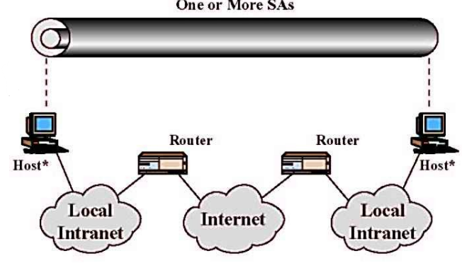

# Lezione di mercoledì 15 maggio 2024

## Progetti

1. Studio analitico dell'argomento (definizione e contestualizzazione)
2. Contestualizzazione nello stato dell'arte
3. Studio dei metodi per fare un determinato argomento
4. Dimostrazione di come l'argomento possa essere attaccato o difeso, violato o irrobustito
5. Sperimentazione di attacco o difesa
6. Trarre delle conclusioni

Scrivere in una relazione tutto questo e preparare una demo ovvero una dimostrazione di quello che ho fatto, infine si sottopone il progetto caricando la relazione e presentando la demo all'esame.
Il progetto ha esito booleano e validità annuale 

**Progetto assegnato:** Pseudonimizzazione (Attacco)

Differenza tra attacco e difesa:
Se ho un progetto in difesa devo prima capire le strategie di attacco, se sto attaccando bisogna parlare dei meccanismi di difesa che si vanno a bypassare

## Tipo 1 di combinazioni SA: sicurezza punto-punto

1. AH in trasporto 
2. ESP in trasporto
3. 1 & 2

I nodi intermediari non devono per forza essere IPSEC-complient

## Tipo 2 di combinazioni SA: sicurezza fra intermediari

1. AH in tunnel
2. ESP in tunnel

Gli host non devono per forza essere IPSEC-complient e gli attacchi avverranno su internet

## Tipo 3 di combinazioni SA: tipo 1 & tipo 2

Combinazione delle tipologie appena viste

1. Combinazione di tipo 1 punto-punto
2. Combinazione di tipo 2 fra intermediari

Aggiunta di un tunnel tra i gateway, se ci fosse un problema sui gateway ci sarebbe il tunnel interno a protezione della comunicazione

## Tipo 4 di combinazioni SA: tipo 1 & sicurezza punto intermedio

1. Combinazione di tipo 1 punto-punto
2. AH in tunnel o ESP in tunnel

Creo un tunnel tra l'host ed il gateway, i nodi devono essere IPSEC

## Internet Key Exchange (IKE)

Protocollo per la generazione delle chiavi da utilizzare con AH ed ESP.

IKE si fonda su una variante arricchita di Diffie-Hellman, integrata con ISAKMP. L'uso della cifratura asimmetrica favorisce la rapida e efficiente condivisione delle chiavi simmetriche. IPSEC, tramite il protocollo ISAKMP, elimina la necessità di avere chiavi aggiornate continuamente.

## Intrusione versus Malware

- Un intruso è un processo utente reale con determinati privilegi.
- I virus raramente possono essere considerati tipi particolari di intrusi. Un virus non è paragonabile a un batterio.
- Un worm, più facilmente, può essere considerato un tipo di intruso. Come un batterio, è autonomo.
- Un intruso non è né un virus né un worm, ma può installarne uno. Si fa riferimento ai processi intrusi come evidenziato dal comando "top" in Linux.

## Intrusione versus DoS

DoS:
- Effetti temporanei
- Immediatamente pubblico
- Blocco delle risorse

Intrusione:
- Effetti generalmente permanenti
- Spesso non reso pubblico
- Uso illecito di risorse

Gli attacchi DoS bloccano una macchina, gli intrusi sfruttano il sistema si parla di stealth e non valutabile

## Negazione del servizio DoS

La negazione del servizio (DoS) è un tipo di attacco informatico che mira a impedire la normale operatività di un sistema, rendendolo inaccessibile agli utenti legittimi. Esistono diverse tipologie di attacchi DoS:

1. **cDoS (Consumo di risorse computazionali)**: Questo tipo di attacco sfrutta il consumo eccessivo di risorse computazionali del sistema bersaglio, come la CPU, impedendo così il normale funzionamento dei servizi.

2. **mDoS (Consumo della memoria)**: In questo caso, l'attaccante satura la memoria del sistema bersaglio, impedendo l'accesso ai dati e ai servizi.

3. **bDoS (Consumo della banda di trasmissione)**: Questo tipo di attacco sovraccarica la banda di trasmissione del sistema, rendendo difficile o impossibile per gli utenti legittimi accedere ai servizi.

Inoltre, c'è il concetto di **DDoS (Distributed Denial of Service)**, che è una variante più sofisticata del DoS, in cui l'attacco è orchestrato da più macchine collegate in rete, spesso sfruttando una botnet. Questo rende l'attacco più potente e difficile da mitigare.

Gli attacchi DoS sono indipendenti dall'autenticazione e possono essere eseguiti anche su sistemi autenticati. L'obiettivo principale è sovraccaricare il sistema o esaurire le sue risorse critiche, rendendolo inutilizzabile per gli utenti legittimi.

Nel contesto dell'Internet of Things (IoT), la sicurezza riveste un ruolo cruciale, poiché i dispositivi connessi potrebbero essere vulnerabili agli attacchi DoS e potrebbero essere utilizzati come parte di una botnet per lanciare attacchi DDoS su larga scala.

## DOS vs DDOS

DoS è un attacco che sfrutta un router con funzionalità di broadcast. L'attaccante invia un pacchetto PING utilizzando l'indirizzo IP della vittima. Questo pacchetto viene poi riflesso da tutte le macchine nella sottorete, creando un attacco DDoS che sovraccarica il sistema bersaglio. In un'altra variante, l'attaccante istruisce un certo numero di "zombie" (macchine compromesse) a contattare un particolare indirizzo IP, il che porta alla saturazione della macchina dietro quell'IP.

## Come reagire ad un DoS

Come affrontare un attacco DoS è ancora una sfida complessa oggi. Esistono firewall dotati di moduli antidos che possono filtrare il traffico, mentre un'alternativa strategica è l'implementazione della trasformazione dei cookie. Ma quale dovrebbe essere la risposta?

- Per un attacco DoS, una strategia è quella di chiudere le connessioni provenienti dalla rete attaccante.
- Ma per un attacco DDoS, chiudere tutte le connessioni può essere difficile e sconveniente.
- Una soluzione potrebbe essere il filtraggio del numero di connessioni accettate, ad esempio tramite htaccess con un firewall.
- Inoltre, una euristica di prevenzione potrebbe consistere nel complicare computazionalmente l'accesso, ad esempio tramite la trasformazione dei cookie (transformation cookie).

## Anti-DoS: Cookie Transformation

Se il protocollo è semplice, l'attaccante può sfruttarlo per inviare più richieste contemporanee, causando confusione al server che potrebbe non essere in grado di gestirle tutte.

Una strategia per contrastare questo tipo di attacco è la trasformazione dei cookie. Il server, anziché rispondere direttamente con il messaggio m2, invia inizialmente un messaggio più semplice, m2s, sotto forma di cookie. Il protocollo richiede quindi al client di inviare lo storico dei messaggi m1 e m2s, insieme all'hash tra m1 e m2s. La verifica dell'hash è un'operazione veloce e consente al server di capire se il client è attivo dall'altra parte. Solo a questo punto, il server risponderà, poiché ha confermato l'attività del client.

Se il client non fosse attivo e cercasse di eseguire un attacco del tipo fork bomb, creando un loop malevolo di richieste, non sarebbe in grado di mantenere lo storico dei messaggi e calcolare l'hash richiesto. Di conseguenza, non avrebbe la possibilità di completare l'operazione richiesta, fornendo una protezione aggiuntiva contro gli attacchi DoS.

## Intrusione

L'intrusione si verifica quando un individuo ottiene in modo illecito privilegi superiori a quelli legittimamente posseduti.

- Questo può avvenire attraverso l'acquisizione di accesso al sistema e l'estensione dei propri privilegi.
- Non è necessariamente limitato alle intrusioni dalla rete, ma può coinvolgere anche l'inserimento di software dannoso tramite dispositivi come floppy disk o pen drive.
- Spesso coinvolge la violazione dei meccanismi di autenticazione e controllo degli accessi.

In sintesi, l'intrusione comporta l'ottenimento di privilegi non autorizzati, violando le regole di accesso e autenticazione del sistema.

## Tecniche di Intrusione

Tecniche di intrusione
- Violazioni di password: tecniche standard e non-standard
- Intercettazione di informazioni sensibili: scovarle (non solo password) se transitano in rete senza crittografia oppure violare protocolli di sicurezza
- Uso di combinazioni di SW nocivo: sullo stile del worm Morris

## Intrusion Detection VS Intrusion Management

- **Intrusion Detection (rilevamento dell'intrusione):** È il processo di individuare attività sospette o non autorizzate all'interno di un sistema o di una rete. L'obiettivo principale è rilevare l'intrusione il prima possibile per prendere provvedimenti e prevenire danni maggiori.

- **Intrusion Management (gestione dell'intrusione):** Una volta individuato un intruso, questo processo mira ad espellerlo dal sistema o dalla rete il più rapidamente possibile per limitare i danni che può causare. L'obiettivo è minimizzare l'impatto negativo sull'integrità, la disponibilità e la riservatezza dei dati e dei servizi.

## Intrusion Detection System (IDS)

## Sistema di Rilevamento delle Intrusioni (IDS)

Un IDS registra e valuta i log, analizzandoli per individuare attività sospette. L'approccio consiste nel registrare tutti i dettagli, il che si rivela prezioso in caso di problemi, consentendo un'auditing efficace dei log (come il comando "history" in Linux). In caso di attacco, l'IDS è responsabile di analizzare i log.

Questo sistema può operare sia in tempo reale che in modalità post-mortem, consentendo di individuare intrusioni nel sistema in tempo reale.

Un Security Operations Center (SOC) è un insieme di tecnologie che consente di esternalizzare la gestione della rilevazione e prevenzione degli attacchi. Queste tecnologie, alimentate dall'intelligenza artificiale, offrono opportunità di lavoro per gli analisti SOC.

Un insieme di tecnologie IDS costituisce una tecnologia nota come SIEM / SOAR (Security Incident and Event Management), che comprende sistemi di rilevamento delle intrusioni.

Un IDS può essere implementato a livello di nodo sulla nostra macchina o come un sistema di rete. Il suo obiettivo è riconoscere i processi non autorizzati.

Per definire quali processi siano considerati non autorizzati, si possono adottare diverse strategie. Ad esempio, si può utilizzare una whitelist dei processi su una distro standard: i processi non presenti nella whitelist vengono considerati alieni. Tuttavia, questa soluzione statica potrebbe non essere sempre efficace. In alternativa, è possibile adottare un approccio dinamico che studia il comportamento del processo, analizzandolo per identificare eventuali comportamenti dannosi.

In sintesi, un IDS registra il comportamento del sistema, analizzando i log attraverso tecniche di pattern matching e operando in tempo reale. Un IDS distribuito può coinvolgere più processi o macchine per la registrazione, l'analisi e la presa di decisioni.

## Definire i comportamenti

Il principale ostacolo per un Sistema di Rilevamento delle Intrusioni (IDS) è identificare i comportamenti dell'intruso in contrasto con quelli dell'utente legittimo. Questo può essere affrontato considerando il comportamento medio nel tempo e utilizzando tecniche di machine learning.

Tuttavia, l'obiettivo è trovare il miglior compromesso tra scambiare un utente legittimo per un intruso (falso positivo) e non rilevare un intruso come tale (falso negativo).

## Record di auditing

Ci servono i log, le entry di un log si chiamano record

1. **Record Nativi:**
   - Tutti i sistemi operativi includono funzionalità per la raccolta di informazioni generiche sulle attività degli utenti.
   - Questi possono includere la storia dei comandi della shell.
   - Sebbene questa sia una soluzione semplice, non sempre fornisce informazioni dettagliate e utili.
2. **Record Specifici per il Rilevamento:**
   - Si tratta di software aggiuntivo progettato per raccogliere esclusivamente informazioni specifiche per il rilevamento delle intrusioni.
   - Questo tipo di record può evidenziare deviazioni dal modello statistico o comportamenti sospetti.
   - Anche se può appesantire il sistema, fornisce informazioni mirate e utili per il rilevamento delle intrusioni.

Gli accessi vanno loggati e per legge ci vuole in certi casi.

## Record di Denning

I record di Denning sono un esempio di record specifici per il rilevamento delle intrusioni, ciascuno contenente sei campi distinti:

1. **Soggetto:** Rappresenta l'utente o il processo che esegue azioni tramite comandi specifici. Possono essere raggruppati in classi di accesso, noti anche come ruoli.
2. **Azione:** Indica l'operazione che il soggetto svolge sul sistema.
3. **Oggetto:** Rappresenta l'entità su cui viene svolta l'azione. È importante notare che un soggetto può anche essere un oggetto, consentendo un'analisi più dettagliata delle interazioni nel sistema.
4. **Eccezione:** Specifica se è stata prodotta un'eccezione in risposta all'azione e, in tal caso, quale eccezione è stata generata.
5. **Utilizzo delle risorse:** Questo campo fornisce informazioni dettagliate sulle risorse utilizzate durante l'azione, come il numero di righe stampate o visualizzate, il numero di settori letti o scritti, il tempo CPU impiegato e le unità di I/O utilizzate.
6. **Timestamp:** Serve come identificatore temporale che indica il momento in cui è iniziata l'azione.

Questi record offrono un quadro completo delle attività nel sistema, consentendo un'analisi approfondita per il rilevamento e la gestione delle intrusioni.

## Tecniche di rilevamento

1. **Indipendenti dal Passato (Standard):**
   - Queste tecniche si basano su criteri predefiniti che non tengono conto delle precedenti attività nel sistema.
   - Un esempio è l'imposizione di un limite massimo di tentativi di inserimento della password, ad esempio massimo 3 fallimenti consentiti.

2. **Dipendenti dal Passato:**
   - Queste tecniche si basano sull'osservazione o campionamento del funzionamento o comportamento del sistema in passato.
   - Si assume che il comportamento futuro sarà simile a quello passato.

Le tecniche di rilevamento possono essere suddivise in:

1. **Rilevamento Statistico:**
   - Si tratta di creare un modello statistico del comportamento di un utente legittimo.
   - Quando un utente o un processo si discosta in modo significativo da questo modello, viene identificato come un potenziale intruso.
   - Questo metodo è particolarmente efficace per individuare attaccanti esterni che possono comportarsi in modo diverso dagli utenti legittimi.

2. **Rilevamento a Regole:**
   - In questo approccio, vengono definite regole per il comportamento di un intruso.
   - Quando un'attività corrisponde a una di queste regole, viene identificata come potenziale intrusione.
   - Questo metodo è particolarmente efficace nel rilevare attaccanti interni che potrebbero avere una conoscenza approfondita del sistema e delle sue regole di funzionamento.

Queste tecniche non sono intelligenti, con nuove tecniche di machine learning è possibile prevedere eventuali cambi di programma.

- Rilevamento statistico: Creo un modello statistico per il comportamento di un utente legittimo
Se l'intruso si discosta sufficientemente dal processo allora lo flaggo come intruso

- Rilevamento a regole: Fare più di n tentativi in una certa fascia oraria vieni flaggato come intruso (due regole in questo caso)

## Rilevamento Statistico - Modelli

1. **Media e Deviazione Standard:** Questo modello calcola la media e la deviazione standard di un parametro nel corso del tempo. Questi valori forniscono un'indicazione del comportamento medio del parametro e della sua variabilità.
2. **Modello Operativo:** Questo modello definisce un limite di accettabilità per un parametro e segnala un'eventuale intrusione quando questo limite viene superato. È un approccio basato su soglie di allarme.
3. **Multivariazione:** In questo modello, vengono considerate più variabili simultaneamente per identificare modelli complessi di comportamento anomalo.
4. **Processo di Markov:** Questo modello utilizza la teoria dei processi stocastici per modellare il comportamento del sistema nel tempo e prevedere le transizioni tra diversi stati.
5. **Serie Temporale:** Questo modello analizza le variazioni di un parametro nel tempo, consentendo di individuare tendenze, stagionalità e comportamenti anomali nel tempo.

Ad esempio, il tempo trascorso dall'ultimo login potrebbe essere utilizzato come parametro per il rilevamento statistico. Un account inattivo da troppo tempo che effettua il login potrebbe indicare un account compromesso o non più utilizzato, noto anche come "account death".

## Rilevamento a Regole

Il rilevamento a regole si basa su un vasto database di regole predefinite, ciascuna progettata per identificare modelli specifici di comportamento sospetto o attività anomale nel sistema.

Esempi noti di sistemi basati su regole includono Snort e ntop. Snort, ad esempio, utilizza un linguaggio di regole flessibile e potente, che permette agli amministratori di definire regole personalizzate per il rilevamento di attacchi e intrusioni. 

Ogni regola di Snort, in sostanza, è simile a scrivere una riga di controllo di iptables, fornendo un metodo efficace per identificare e rispondere a varie tipologie di minacce informatiche.

## Tecniche di protezione

## Tecniche di Protezione

1. **Limitazione dell'Automazione:** Questa tecnica mira a limitare il numero di tentativi di accesso automatico per prevenire attacchi di forza bruta o di tentativi ripetuti. Ad esempio, il sistema può essere configurato per ripristinare la connessione dopo un numero specifico di inserimenti di password errate (come 3), o il telefono cellulare può bloccare la SIM dopo un certo numero di tentativi di inserimento del PIN errati.

2. **Utilizzo di Esche: (Honey Pot)** Le esche sono risorse fittizie progettate per attirare gli attaccanti e distoglierli dalle risorse più importanti o per farli rimanere più a lungo nel sistema, consentendo al sistema di identificarli e intraprendere azioni preventive. Ad esempio, possono essere creati URL come "transazioni.grossasocieta.com" o "conticorrenti.banca.com", che sembrano legittimi ma conducono a risorse monitorate.

3. **Utilizzo di Trappole:** Questa tecnica prevede il massiccio monitoraggio di risorse fittizie o esche, e appena l'attaccante accede a una di esse, viene attivata una trappola che permette di rilevare e rispondere all'attacco in tempo reale.

## Domande di esame

- Esempi legati al rilevamento statistico di intrusioni in caso di attività di login
- Differenza tra DoS ed intrusione (bloccare il sistema e sfruttare il sistema)
- Numero di password failures è un tentativo di controllo a soglia non è adatto ad uno di tipo media e varianza
- Esempio di rilevamento statistico di intrusioni legato alle attività di shell di comando: Frequenza di esecuzione di un comando, attività di accesso ad un file quanto leggi e quanto scrivi